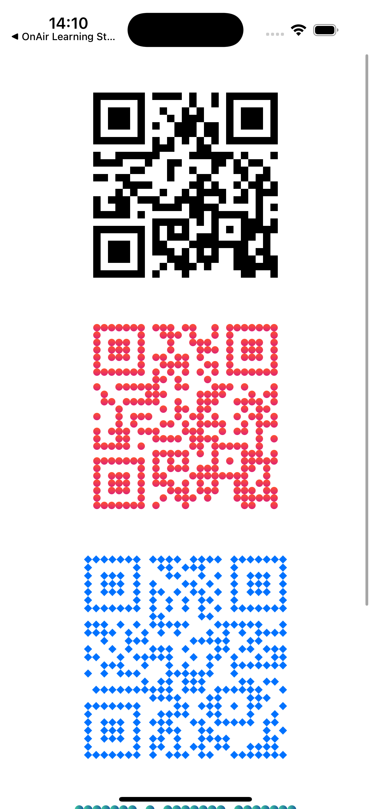
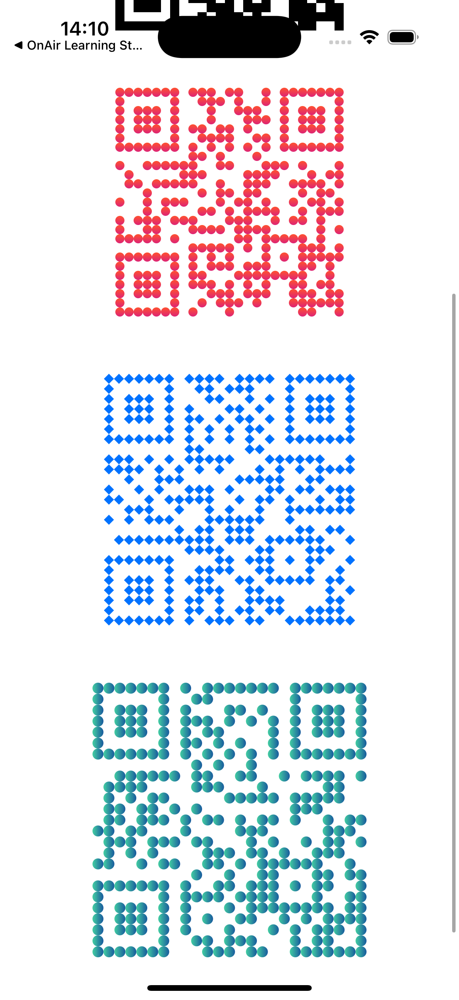

# react-native-fast-qrcode

A customizable QRCode component for React Native, built with react-native-svg
and qrcode
.

✨ Features:

✅ Basic QR code rendering

🎨 Custom styles: square, circle, diamond, rounded

🌈 Gradient fill

🖼️ Logo overlay in center

🎯 Custom finder patterns (color, rounded corners)

## Installation

```sh
yarn add react-native-fast-qrcode react-native-svg qrcode
# or
npm install react-native-fast-qrcode react-native-svg qrcode

```

## Usage

```js
import { multiply } from 'react-native-fast-qrcode';

// ...

import { View, StyleSheet, ScrollView } from 'react-native';
import { QRCode } from 'react-native-fast-qrcode';

export default function App() {
  return (
    <ScrollView>
      <View style={styles.container}>
        {/* Basic QR */}
        <QRCode value="https://example.com1" size={200} ecl="M" />

        {/* Circle style + gradient */}
        <QRCode
          value="https://example.com2"
          size={200}
          style="circle"
          gradient={{ from: '#ff512f', to: '#dd2476', direction: 'vertical' }}
        />

        {/* Diamond style + logo */}
        <QRCode
          value="https://example.com3"
          size={220}
          style="diamond"
          color="#0072ff"
          // logo={require('./assets/logo.png')}
          logoSize={50}
        />

        {/* Rounded + finder pattern custom */}
        <QRCode
          value="https://example.com4"
          size={240}
          style="rounded"
          cornerRadius={6}
          finderColor="#ff5722"
          finderRadius={8}
          gradient={{ from: '#43cea2', to: '#185a9d', direction: 'horizontal' }}
          // logo={require('./assets/logo.png')}
          logoSize={50}
          backgroundColor="white"
        />
      </View>
    </ScrollView>
  );
}

const styles = StyleSheet.create({
  container: {
    flex: 1,
    alignItems: 'center',
    justifyContent: 'center',
    gap: 50,
    marginTop: 100,
  },
});
```

## Props

| Prop                | Type                                                                   | Default         | Description                                          |
| ------------------- | ---------------------------------------------------------------------- | --------------- | ---------------------------------------------------- |
| **value**           | `string`                                                               | required        | Nội dung sẽ được encode trong QR Code                |
| **size**            | `number`                                                               | `200`           | Kích thước QR code (chiều rộng & cao)                |
| **color**           | `string`                                                               | `black`         | Màu của các ô QR                                     |
| **backgroundColor** | `string`                                                               | `white`         | Màu nền phía sau QR                                  |
| **ecl**             | `'L' \| 'M' \| 'Q' \| 'H'`                                             | `'M'`           | Mức độ **Error Correction Level** (sửa lỗi khi scan) |
| **style**           | `'square' \| 'circle' \| 'diamond' \| 'rounded'`                       | `'square'`      | Hình dạng module QR                                  |
| **cornerRadius**    | `number`                                                               | `4`             | Độ bo góc (áp dụng khi `style="rounded"`)            |
| **gradient**        | `{ from: string; to: string; direction?: 'vertical' \| 'horizontal' }` | `undefined`     | Gradient fill cho module QR                          |
| **logo**            | `string \| number`                                                     | `undefined`     | Logo ở giữa QR (hỗ trợ `require()` hoặc URL ảnh)     |
| **logoSize**        | `number`                                                               | `40`            | Kích thước logo (width & height)                     |
| **finderColor**     | `string`                                                               | same as `color` | Màu **Finder Pattern** (3 ô vuông lớn của QR code)   |
| **finderRadius**    | `number`                                                               | `0`             | Bo góc cho **Finder Pattern**                        |

## Contributing

- [Development workflow](CONTRIBUTING.md#development-workflow)
- [Sending a pull request](CONTRIBUTING.md#sending-a-pull-request)
- [Code of conduct](CODE_OF_CONDUCT.md)

## License

MIT

---

Made with [create-react-native-library](https://github.com/callstack/react-native-builder-bob)
